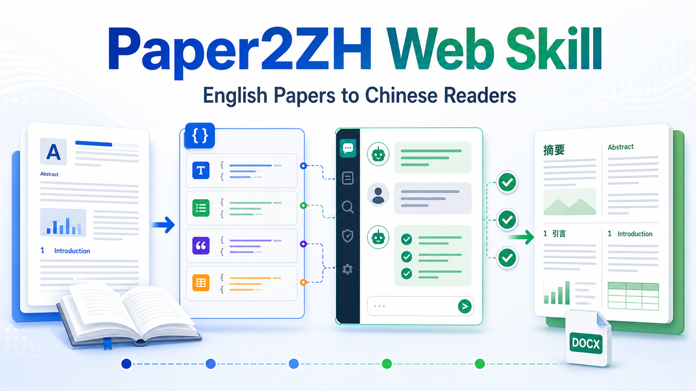

# Paper2ZH ChatGPT Web Skill



Translate English academic papers into Chinese bilingual DOCX/Markdown readers with structured JSON jobs, manual ChatGPT Web exchange, deterministic validation, and an optional QA review pass.

The installed Codex skill name is `chatgpt-web-json-reader`.

## Why This Exists

Most paper translation workflows either paste long text into a chat box or rely on API calls that become expensive for large documents. This skill keeps document processing local, turns the paper into structured JSON jobs, lets ChatGPT Web do the language work, then validates and renders the final bilingual reader.

It is designed for high-volume English-to-Chinese academic translation where quality, structure, and reviewability matter.

## Key Features

- English paper to Chinese bilingual reader workflow.
- Manual ChatGPT Web upload/download instead of API-heavy translation calls.
- Uses the current native ChatGPT Web model available to the user.
- Uses PaddleOCR AI Studio hosted OCR for PDF source conversion, with quota handled by the user's own AI Studio account.
- Structured JSON translation jobs instead of uncontrolled long-paste translation.
- Deterministic local validation before merge and render.
- Optional QA review job for omissions, mistranslations, terminology drift, table values, citations, units, math symbols, and readability.
- Markdown, DOCX, and JSON final outputs.
- Table-aware translation with cell-level mapping.
- Rich-text preservation for Office Math, drawings, hyperlinks, bold, italic, underline, strike, superscript, and subscript.
- Bundled PaddleOCR MCP server for PDF-to-DOCX source conversion.

## Workflow Overview

```text
English paper PDF/DOCX
        |
        | PDF only: PaddleOCR MCP -> source DOCX
        v
Local document parser
        |
        v
Structured JSON translation jobs
        |
        | manual upload/download
        v
ChatGPT Web
        |
        v
Local validation -> merge -> optional QA review -> final render
        |
        v
Chinese bilingual Markdown / DOCX / JSON
```

## Bundled PaddleOCR MCP For PDF Input

For PDF papers, this project includes a PaddleOCR MCP server under `mcp/paddleocr/`. It converts the source PDF into a structurally usable DOCX before translation.

When the MCP tool is configured, use it first:

```text
mcp__paddleocr__ocr_extract(
  file_path="/path/to/source.pdf",
  output_format="docx",
  output_dir="/path/to/reader_task/source_mcp"
)
```

Then pass the generated DOCX to `readerctl.py`.

The skill intentionally avoids using `pdftotext`, manual copy-paste, or ad hoc text extraction as the default PDF path, because those methods can destroy reading order, table structure, and bilingual render quality.

The access token is not stored in code. Configure it through an external private env file or the MCP host environment. See `mcp/paddleocr/README.md`.

## Main Entry Point

```bash
python scripts/readerctl.py --help
```

For the full workflow, see:

- `SKILL.md`
- `references/runbook.md`
- `references/mcp-paddleocr.md`
- `references/output-spec.md`
- `references/prompt-contracts.md`
- `references/recovery.md`
- `mcp/paddleocr/README.md`

## Installation

Clone this repository into your Codex skills directory using the installed skill folder name:

```bash
mkdir -p ~/.codex/skills
git clone https://github.com/hututuo/paper2zh-chatgpt-web-skill.git \
  ~/.codex/skills/chatgpt-web-json-reader
```

## Requirements

- Python 3.
- `python-docx` for DOCX parsing and rendering.
- Manual access to ChatGPT Web for upload/download exchange.
- AI Studio access token for the bundled PaddleOCR MCP server when translating from PDF.

## MCP Boundary

This repository bundles a small PaddleOCR MCP server, but it does not bundle your access token. The PDF workflow assumes the agent has configured the bundled server and can call `mcp__paddleocr__ocr_extract` before `readerctl.py`.

```text
PDF paper
  -> bundled PaddleOCR MCP, output_format="docx"
  -> source.docx
  -> readerctl.py prepare-translation
```

For DOCX input, the MCP step is not needed. For PDF input, do not silently replace the MCP step with `pdftotext` or manual text extraction; those paths can break reading order and table structure.

### Get And Configure The PaddleOCR Token

1. Go to the AI Studio Access Token page: <https://aistudio.baidu.com/index/accessToken>
2. Copy the access token.
3. Check the current free quota shown by your AI Studio/PaddleOCR account page.
4. Configure it locally in a private folder outside the repository:

```bash
mkdir -p ~/.config/paper2zh-chatgpt-web-skill/secrets
chmod 700 ~/.config/paper2zh-chatgpt-web-skill ~/.config/paper2zh-chatgpt-web-skill/secrets
cp mcp/paddleocr/.env.example ~/.config/paper2zh-chatgpt-web-skill/secrets/paddleocr.env
chmod 600 ~/.config/paper2zh-chatgpt-web-skill/secrets/paddleocr.env
```

Then edit `~/.config/paper2zh-chatgpt-web-skill/secrets/paddleocr.env`:

```text
PADDLEOCR_ACCESS_TOKEN=your-access-token-here
```

Point your MCP host at that file with `PADDLEOCR_MCP_ENV_FILE`.

## Typical Flow

For an already usable DOCX source:

```bash
python scripts/readerctl.py prepare-translation \
  --bundle /path/to/reader_task \
  --source-docx /path/to/source.docx

python scripts/readerctl.py accept-downloads --bundle /path/to/reader_task --stage translation
python scripts/readerctl.py validate-model-outputs --bundle /path/to/reader_task --stage translation
python scripts/readerctl.py finish-fast --bundle /path/to/reader_task --format md,docx,json
```

Use the full QA path in `SKILL.md` when a second ChatGPT Web review pass is required.

## What Gets Sent To ChatGPT Web

ChatGPT Web receives prompt files plus strict JSON input files. It should return downloadable raw JSON output files such as:

- `translation_job_001_output.json`
- `qa_job_001_output.json`

Local Python scripts then validate identifiers, hashes, coverage, rich-text tokens, table cells, and QA suggestions before producing final outputs.

## Rich Text And Structure

Non-translatable inline objects, such as Office Math, drawings, and hyperlinks, are protected as `[[RT:...]]` tokens and cloned back into the final DOCX.

Visible formatting runs are exposed to ChatGPT as HTML inline tags:

- `<b>`
- `<i>`
- `<u>`
- `<s>`
- `<sup>`
- `<sub>`

This keeps formatted text visible to the model while still allowing local DOCX rendering to restore Word styling.

## Best Use Cases

- Translating English research papers into Chinese.
- Building bilingual reading documents for literature review.
- Handling large documents while saving API quota.
- Keeping translation jobs auditable and resumable.
- Running a second structured QA review pass after translation.

## Repository Notes

This repository should contain the reusable skill source only. Local translation bundles, downloads, generated readers, bytecode caches, and document artifacts are intentionally ignored.
